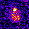
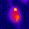
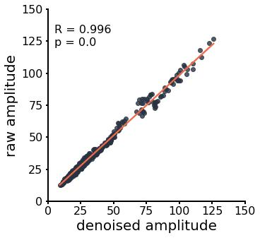

# Deep iGlu Denoiser Documentation

## Table of Contents

- [Overview](#overview)
- [Getting Started](#getting-started)
- [Usage](#usage)
- [Training a Custom Model](#training-a-custom-model)
  - [Prepare Training Data](#1-prepare-training-data)
  - [Prepare Config File](#2-prepare-config-file)
  - [Train the Model](#3-train-the-model)
- [Utils](#utils)
  - [Filter h5 file](#filter-h5-file)  

## Overview

The Deep iGlu Denoiser is a powerful tool designed for denoising microscopic recordings, offering pre-trained model weights for the **iGlu-Snfr3 sensor** ready to use. This denoising is built upon the [U-Net](https://link.springer.com/chapter/10.1007/978-3-319-24574-4_28) model architecture. The model can be trained on any microscopic data, without the need for manual data curation.

| **raw**                                                                | denoised                                                                              |
| ---------------------------------------------------------------------- | ------------------------------------------------------------------------------------- |
|  |  |

The Deep iGlu Denoiser maintains the amplitude heights and therefore does not alter subsequent analysis. 



## Getting started

Follow these steps to set up Deep iGlu Denoiser:

1. **Create a new enviorment:**
   
   ```bash
   conda create -n deep_iglu_denoiser python=3.10 pip
   conda activate deep_iglu_denoiser
   ```

2. **Clone the repository:**
   
   ```bash
   git clone https://github.com/s-weissbach/deep_iglu_denoiser.git
   cd deep_iglu_denoiser
   ```

3. **Install:**
   
   ```bash
   pip install -e .
   ```

4. **Download pre-trained model:**
   Download the pre-trained model from [the release page](https://github.com/s-weissbach/deep_iglu_denoiser/releases/) and place it in the project directory.

## Usage

> [!Tip]
> The `--directory_mode` will presever the folderstructure of the input folder.

Activate the conda enviorment:

```bash
conda activate deep_iglu_denoiser
```

Run the following command to denoise images using the provided script:

```bash
python -m deep_iglu_denoiser.denoise --path /path/to/images --modelpath /path/to/model_weights --directory_mode -o /output/path
```

> [!IMPORTANT]
> Although the Deep iGlu Denoiser will work without a NVIDIA graphics card, it will run significantly slower. We highly recommend to only work on a server/PC with an available graphics card.

### Arguments:

| Argument           | Shorthand | Description                                       |
| ------------------ | --------- | ------------------------------------------------- |
| `--path`           | `-p`      | Path to input imagestack or directory             |
| `--modelpath`      | `-m`      | Path to pre-trained model weights                 |
| `--directory_mode` | `-d`      | Enable directory mode (preserve folder structure) |
| `--outputpath`     | `-o`      | Path to output directory                          |
| `--batchsize`      | `-b`      | Number of frames predicted at once (default: 1)   |
| `--cpu`            |           | Force CPU useage, even if a GPU was found         |

### Supported File Formats

- tiff-based formats: `.tif, .tiff, .stk`

- Nikon format: `.nd2`

All files will be written as a `.tiff`file.

If you require other file formats to be supported, feel free to open an issue on GitHub.

## Example

Denoise a single recording:

```bash
python -m deep_iglu_denoiser.denoise --path /path/to/imagestack.tiff --modelpath /path/to/model.pt --outputpath /output/path
```

Denoise all recordings in a directory:

```bash
python -m deep_iglu_denoiser.denoise --path /path/to/images_folder --modelpath /path/to/model_weights --directory_mode -o /output/path
```

# Training a Custom Model

To train a custom model for denoising, follow these steps:

## 1. Prepare Training Data

> [!WARNING]
> Potentially uses a lot of RAM. If you have limited RAM capicity use `--memory_optimized`. Beware that this will increase execution time.

> [!NOTE]
> The recordings itself can be noisy.

Prepare the creation by storing all recordings with **one sensor** in a directory `/path/to/traindata/`. 

There are two modes to create the trainings data. 

1. Stimulation based identification:
   - requires `--stimulationframes` and `--n_frames`` as an input
   - identifies active regions by maximum projection of the z-normalized image
   - extracts all responses (regions of size ROI that exceeded the `min_z_score` in the maximum projection) for each stimulation
2. Activitymap based identification:
   - requires `--activitymap` flag to be set
   - does not need recordings with stimulation
   - applies rolling window z-normalization and identifies regions that exceed the `min_z_score` and the frame in that it happens
   - adds all stimulation responses of the selected regions, if `--stimulationframes` is set
> [!NOTE]
> Activitymap runs 6x slower, but will detect more events. Stimulation based mode will only search for responses after the stimulation

Use the `prepare_trainfiles` script to generate training data from a set of images. The script takes the following arguments:

| Argument                  | Shorthand     | Description                                                      |
|---------------------------|---------------|------------------------------------------------------------------|
| `--path`                  | `-p`          | Path to the folder containing images                             |
| `--fileendings`           | `-f`          | List of file endings to consider                                 |
| `--crop_size`             | `-c`          | Crop size used during training (default: 32)                     |
| `--roi_size`              |               | Expected ROI size; assumes detection square of (roi_size x roi_size) (default: 4) |
| `--trainh5`               | `-t`          | Path to the output H5 file that will be created                  |
| `--min_z_score`           | `-z`          | Minimum Z score to be considered an active ROI (default: 2)      |
| `--min_z_score_activity`  | `-za`         | Minimum Z score to be considered a response, only used with stimulation based identification (default: 1.5) |
| `--activitymap`           |               | Extract synaptic responses without any prior information        |
| `--stimulationframes`     |               | Frames in that stimulation was applied. Will extract responses of active regions from stimulationframe to stimulationframe + `--n_frames` |
| `--n_frames`              |               | Number of frames to include after stimulation (default: 0) |
| `--window_size`           | `-w`          | Number of frames used for rolling window z-normalization (default: 50) |
| `--fgsplit`               | `-s`          | Foreground to background split (default: 0.5)                    |
| `--overwrite`             |               | Overwrite existing H5 file. If false, data will be appended (default: False) |
| `--memory_optimized`      |               | Execute preparation process with optimized memory usage. Increases execution time (default: False) |

Example usage:

**Stimulation**
> [!NOTE]
> Stimulation based identification does not consider bleach. Apply bleach correction if needed before running this mode.

``` bash
python -m deep_iglu_denoiser.prepare_trainfiles --path /path/to/traindata --fileendings tif tiff nd2 --crop_size 32 --roi_size 4 --trainh5 training_data.h5 --min_z_score 2.0 --min_z_score_activity 1.5 --stimulationframes 100 200 300 --n_frames 5 --fgsplit 0.8 --overwrite False --activitymap
```

**Activitymap**
``` bash
python -m deep_iglu_denoiser.prepare_trainfiles --path /path/to/traindata --fileendings tif tiff nd2 --crop_size 32 --roi_size 4 --trainh5 training_data.h5 --min_z_score 2.0 --window_size 50 --activitymap --fgsplit 0.8 --overwrite False
```

## 2. Prepare config file

Create a `trainconfig.yaml` file with the following configuration settings.

```yaml
modelpath: 'unet.pt'
train_h5: '/path/to/train.h5'
batch_size: 16
learning_rate: 0.0001
num_epochs: 1
noise_center: 0.0
noise_scale: 1.5
```

Adjust the paths and parameters in the configuration file based on your specific setup and requirements. This configuration file will be used during the training process to specify various parameters further:

### Training Configuration File Summary

| Argument        | Description                                                               |
| --------------- | ------------------------------------------------------------------------- |
| `modelpath`     | Path to save the model after training                                     |
| `train_h5`      | Path to the h5 file containing the training data                          |
| `batch_size`    | Number of training examples utilized in one iteration                     |
| `learning_rate` | Rate at which the model's weights are updated during training             |
| `num_epochs`    | Number of times the entire training dataset is passed through the network |
| `noise_center`  | Center of the noise added to the input data during training               |
| `noise_scale`   | Scale of the noise added to the input data during training                |

## 3. Train the model

Run the training script by executing the following command:

```bash
python -m deep_iglu_denoiser.start_training -p /path/to/trainconfig.yaml`
```

`--trainconfigpath (-p)`: Path to the train config YAML file containing training parameters.

When a CUDA capable GPU is found `GPU ready` will be printed; otherwise `Warning: only CPU found`. It is not recommended to train with a CPU only.

# Utils

## Filter h5-file

We've included a convinience function to filter the h5-file with a new z-score, in case you've selected a lot of frames that do not have responses due to a insufficient z-score.

| Flag        | Shorthand | Description                          |
| ----------- | --------- | ------------------------------------ |
| --input_h5  | -i        | Path to the input H5 file            |
| --output_h5 | -o        | Path to the output H5 file           |
| --min_z     | -z        | Minimum Z value for filtering        |
| --roi_size  | -r        | Size of the Region of Interest (ROI) |

### Example

```bash
python -m deep_iglu_denoiser.filter_h5 -i /path/to/input.h5 -o /path/to/output.h5 --min_z 2.0 --roi_size 4
```
