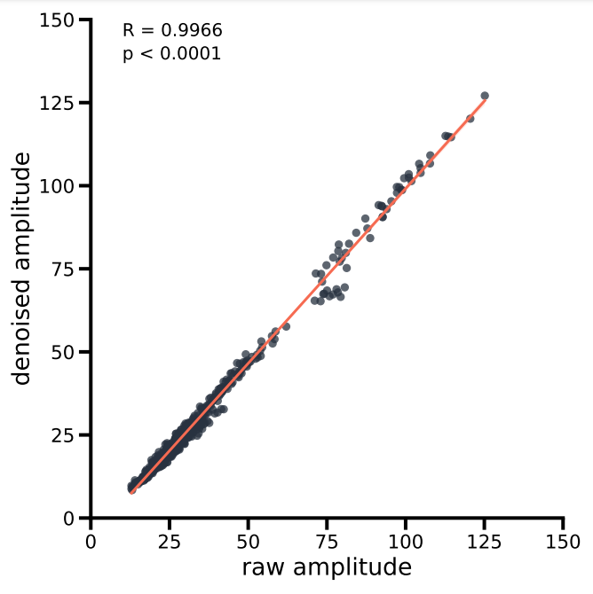

# Neuroimage Denoiser Documentation

## Table of Contents

- [Overview](#overview)
- [Getting Started](#getting-started)
- [Usage](#usage)
- [Training a Custom Model](#training-a-custom-model)
  - [Prepare Training Data](#1-prepare-training-data)
  - [Prepare Config File](#2-prepare-config-file)
  - [Train the Model](#3-train-the-model)
  - [Gridsearch](#gridsearch)
- [Utils](#utils)
  - [Filter h5 file](#filter-h5-file)  
  - [Evaluate Inference Speed](#evaluate-inference-speed)

## Overview

The Neuroimage Denoiser is a powerful tool designed for denoising microscopic recordings, offering pre-trained model weights for the **iGlu-Snfr3 sensor** ready to use. This denoising is built upon the [U-Net](https://link.springer.com/chapter/10.1007/978-3-319-24574-4_28) model architecture. The model can be trained on any microscopic data, without the need for manual data curation.

| **raw**                                                                | denoised                                                                              |
| ---------------------------------------------------------------------- | ------------------------------------------------------------------------------------- |
|  |  |

The Deep iGlu Denoiser maintains the amplitude heights and therefore does not alter subsequent analysis. 



## Getting started

Follow these steps to set up Deep iGlu Denoiser:

1. **Create a new enviorment:**
   
   ```bash
   conda create -n neuroimage_denoiser python=3.10 pip
   conda activate neuroimage_denoiser
   ```

2. **Clone the repository:**
   
   ```bash
   git clone https://github.com/s-weissbach/neuroimage_denoiser.git
   cd neuroimage_denoiser
   ```

3. **Install:**
   
   ```bash
   pip install -e .
   ```

4. **Download pre-trained model:**
   Download the pre-trained model from [the release page](https://github.com/s-weissbach/neuroimage_denoiser/releases/) and place it in the project directory.

## Usage

> [!Tip]
> The `--directory_mode` will presever the folderstructure of the input folder.

Activate the conda enviorment:

```bash
conda activate neuroimage_denoiser
```

Run the following command to denoise images using the provided script:

```bash
python -m neuroimage_denoiser denoise --path /path/to/images --modelpath /path/to/model_weights --directory_mode -o /output/path
```

> [!IMPORTANT]
> Although the Neuroimage Denoiser will work without a NVIDIA graphics card, it will run significantly slower. We highly recommend to only work on a server/PC with an available graphics card.

### Arguments:

| Argument           | Shorthand | Description                                       |
| ------------------ | --------- | ------------------------------------------------- |
| `--path`           | `-p`      | Path to input imagestack or directory             |
| `--modelpath`      | `-m`      | Path to pre-trained model weights                 |
| `--directory_mode` | `-d`      | Enable directory mode (preserve folder structure) |
| `--outputpath`     | `-o`      | Path to output directory                          |
| `--batchsize`      | `-b`      | Number of frames predicted at once (default: 1)   |
| `--cpu`            |           | Force CPU useage, even if a GPU was found         |

### Supported File Formats

- tiff-based formats: `.tif, .tiff, .stk`

- Nikon format: `.nd2`

All files will be written as a `.tiff`file.

If you require other file formats to be supported, feel free to open an issue on GitHub.

## Example

Denoise a single recording:

```bash
python -m neuroimage_denoiser denoise --path /path/to/imagestack.tiff --modelpath /path/to/model.pt --outputpath /output/path
```

Denoise all recordings in a directory:

```bash
python -m neuroimage_denoiser denoise --path /path/to/images_folder --modelpath /path/to/model_weights --directory_mode -o /output/path
```

# Training a Custom Model

To train a custom model for denoising, follow these steps:

## 1. Prepare Training

> [!WARNING]
> Potentially uses a lot of RAM. If you have limited RAM capicity use `--memory_optimized`. Beware that this will increase execution time.

> [!NOTE]
> The recordings itself can be noisy.

Prepare the creation by storing all recordings with **one sensor** in a directory `/path/to/traindata/`. 
Activitymap based identification:

- does not need recordings with stimulation
- applies rolling window z-normalization and identifies regions that exceed the `min_z_score` and the frame in that it happens

Use the `prepare_trainfiles` script to generate training data from a set of images. The script takes the following arguments:

| Argument             | Shorthand | Description                                                                                        |
| -------------------- | --------- | -------------------------------------------------------------------------------------------------- |
| `--path`             | `-p`      | Path to the folder containing images                                                               |
| `--fileendings`      | `-f`      | List of file endings to consider                                                                   |
| `--crop_size`        | `-c`      | Crop size used during training (default: 32)                                                       |
| `--roi_size`         |           | Expected ROI size; assumes detection square of (roi_size x roi_size) (default: 4)                  |
| `--h5`               |           | Path to the output H5 file that will be created                                                    |
| `--min_z_score`      | `-z`      | Minimum Z score to be considered an active ROI (default: 2)                                        |
| `--window_size`      | `-w`      | Number of frames used for rolling window z-normalization (default: 50)                             |
| `--fgsplit`          | `-s`      | Foreground to background split (default: 0.5)                                                      |
| `--overwrite`        |           | Overwrite existing H5 file. If false, data will be appended (default: False)                       |
| `--memory_optimized` |           | Execute preparation process with optimized memory usage. Increases execution time (default: False) |

Example usage:

```bash
python -m neuroimage_denoiser prepare_training --path /path/to/traindata --fileendings tif tiff nd2 --crop_size 32 --roi_size 6 --trainh5 training_data.h5 --min_z_score 2.0 --window_size 50 --fgsplit 0.8 --overwrite False
```

## 2. Prepare config file

Create a `trainconfig.yaml` file with the following configuration settings.

```yaml
modelpath: 'unet.pt'
train_h5: '/path/to/train.h5'
batch_size: 32
learning_rate: 0.0001
num_epochs: 1
noise_center: 0.0
noise_scale: 2.0
```

Adjust the paths and parameters in the configuration file based on your specific setup and requirements. This configuration file will be used during the training process to specify various parameters further:

### Training Configuration File Summary

| Argument        | Description                                                               |
| --------------- | ------------------------------------------------------------------------- |
| `modelpath`     | Path to save the model after training                                     |
| `train_h5`      | Path to the h5 file containing the training data                          |
| `batch_size`    | Number of training examples utilized in one iteration                     |
| `learning_rate` | Rate at which the model's weights are updated during training             |
| `num_epochs`    | Number of times the entire training dataset is passed through the network |
| `noise_center`  | Center of the noise added to the input data during training               |
| `noise_scale`   | Scale of the noise added to the input data during training                |

## 3. Train the model

Run the training script by executing the following command:

```bash
python -m neuroimage_denoiser train -p /path/to/trainconfig.yaml`
```

`--trainconfigpath (-p)`: Path to the train config YAML file containing training parameters.

When a CUDA capable GPU is found `GPU ready` will be printed; otherwise `Warning: only CPU found`. It is not recommended to train with a CPU only.

## Gridsearch

Perform a grid search over training parameters.  First define the parameters that should be tested in `grid_trainconfig.yaml`

```yaml
# training parameters
modelfolder: '/path/to/save_trained_models'
train_h5: '/path/to/training_data.h5'
batch_size: 64
learning_rate: 0.0001
loss_functions: ['L1','Smooth-L1','MSE','Huber']
noise_scales: [0.5,1.0,1.5,2.0,3.0]
noise_centers: [0,0.5,1.0]
gaussian_filter: [True, False]
gaussian_sigma: [0.5,1.0]
num_epochs: 1
# evaluation parameters
batch_size_inference: 1
evaluation_img_path: '/path/to/test_recording.tif'
evaluation_roi_folder: '/path/to/test_roi_set'
stimulation_frames: [100,200]
response_patience: 5
```


Here's a table explaining the grid search configuration parameters:

| Parameter               | Description                                                               | Example Value                         |
| ----------------------- | ------------------------------------------------------------------------- | ------------------------------------- |
| `modelfolder`           | Directory where the trained models will be saved                          | `/path/to/save_trained_models`        |
| `train_h5`              | Path to the H5 file containing the training data                          | `/path/to/training_data.h5`           |
| `batch_size`            | Number of training examples used in one iteration                         | `64`                                  |
| `learning_rate`         | Rate at which the model's weights are updated during training             | `0.0001`                              |
| `loss_functions`        | List of loss functions to be used during training                         | `['L1', 'Smooth-L1', 'MSE', 'Huber']` |
| `noise_scales`          | List of noise scales to be applied to the input data during training      | `[0.5, 1.0, 1.5, 2.0, 3.0]`           |
| `noise_centers`         | List of noise centers to be applied to the input data during training     | `[0, 0.5, 1.0]`                       |
| `gaussian_filter`       | List indicating whether to apply a Gaussian filter to the y_train data    | `[True, False]`                       |
| `gaussian_sigma`        | List of sigma values for the Gaussian filter                              | `[0.5, 1.0]`                          |
| `num_epochs`            | Number of times the entire training dataset is passed through the network | `1`                                   |
| `batch_size_inference`  | Batch size used during inference                                          | `1`                                   |
| `evaluation_img_path`   | Path to the image used for evaluation                                     | `/path/to/test_recording.tif`         |
| `evaluation_roi_folder` | Path to the folder containing regions of interest (ROI) for evaluation    | `/path/to/test_roi_set`               |
| `stimulation_frames`    | List of frame numbers where stimulation occurs                            | `[100, 200]`                          |
| `response_patience`     | Number of frames to wait for a response after a stimulation frame         | `5`                                   |

Once the config file for the gridsearch is set, it can be started by using the command:

```bash
python -m neuroimage_denoiser gridsearch_train --trainconfigpath <path>
```

The gridsearch will save its results to a JSON file.


# Utils

## Filter h5-file

We've included a convinience function to filter the h5-file with a new z-score, in case you've selected a lot of frames that do not have responses due to a insufficient z-score.

| Flag        | Shorthand | Description                          |
| ----------- | --------- | ------------------------------------ |
| --h5        |           | Path to the input H5 file            |
| --output_h5 | -o        | Path to the output H5 file           |
| --min_z     | -z        | Minimum Z value for filtering        |
| --roi_size  | -r        | Size of the Region of Interest (ROI) |

### Example

```bash
python -m neuroimage_denoiser filter_h5 -i /path/to/input.h5 -o /path/to/output.h5 --min_z 3.0 --roi_size 6
```

## Evaluate Inference Speed

The script evaluates the inference speed of Neuroimage Denoiser for image denoising across different crop sizes. It begins by cropping image sequences to specified sizes and then performs model inference, measuring the time taken for each operation. Results are saved in a JSON file, providing a performance benchmark for varying image dimensions.

```bash
python -m neuroimage_denoiser eval_inference_speed --path <path> --modelpath <model_path> --cropsizes <sizes> --num_frames <num> --outpath <output_path> 
```

| Argument       | Shorthand | Description                                            | Required | Example Value            |
| -------------- | --------- | ------------------------------------------------------ | -------- | ------------------------ |
| `--path`       | `-p`      | Path to folder containing images                       | Yes      | `/path/to/images`        |
| `--modelpath`  | `-m`      | Path to model weights                                  | Yes      | `/path/to/model_weights` |
| `--cropsizes`  | `-c`      | List of crop sizes to test                             | Yes      | `32 64 128`              |
| `--num_frames` | `-n`      | Number of frames to test                               | Yes      | `100`                    |
| `--outpath`    | `-o`      | Path to save result                                    | Yes      | `/path/to/save/results`  |
| `--cpu`        |           | Force CPU usage, even if a GPU is available (optional) | No       |                          |
